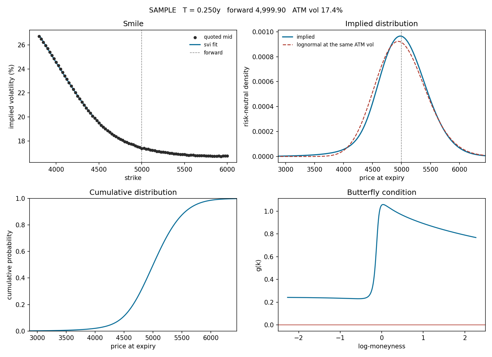

# implied-rnd

[](https://github.com/Amir-stu/implied-risk-neutral-density/actions/workflows/ci.yml)

Option prices contain the market's whole probability distribution for where a
price ends up, not just its volatility. This package extracts it.

The result is due to Breeden and Litzenberger (1978): the risk-neutral density is
the second derivative of the call price in the strike. The intuition is a
butterfly spread — buy a call either side of a strike, sell two in the middle,
and it pays off only if the price lands there. Its price, per unit width, is the
market's probability of that outcome.

Applied literally to quoted prices that recipe does not work. Two numerical
derivatives amplify the bid-ask noise until the density oscillates and goes
negative, which is the failure everyone hits first. This package differentiates
the *smile* instead, in closed form, with non-negativity enforced during the fit
rather than repaired afterwards.

---

## What it does

```bash
pip install -e ".[dev]"
rnd demo
```

```
SAMPLE  method=svi  T=0.2500y  quotes=89
forward 4,999.9024   discount 0.990735   implied rate 3.7231%
atm vol 17.4193%   smile fit rmse 0.028 vol points
mass 1.000005   martingale error +0.00 bp   min density 3.641e-137
quotes: 0 bound, 7 monotonicity and 22 convexity violations across 89 strikes
mean 4,999.9024   sd 453.9989   skew -0.3638   excess kurtosis +1.7407
p(-20%) 0.0200  p(-20%) lognormal 0.0059  p(-10%) 0.1124  p(-10%) lognormal 0.1220
```



The headline is the last line. At the same forward and the same at-the-money
volatility, the market prices a 20% drop at **2.0%** where the lognormal says
**0.6%** — about three and a half times as likely. That gap is the crash risk the
Black-Scholes bell curve does not contain, read straight off live prices.

---

## Using it

On a CSV of quotes (`strike`, `option_type`, `bid`, `ask`):

```bash
rnd estimate quotes.csv --expiry-date 2026-12-18 --out results/
```

On a live chain from Yahoo, with `pip install "implied-rnd[yahoo]"`:

```bash
rnd fetch SPY --expiry-date 2026-12-18 --out results/
```

Each run writes `density.csv`, `fitted_quotes.csv`, `diagnostics.json` and a
four-panel `report.png`.

From Python:

```python
from rnd import OptionChain, estimate_density

chain = OptionChain.from_csv("quotes.csv", expiry=0.25, underlying="SPX")
result = estimate_density(chain, method="svi")

result.density.prob_below(4500)          # risk-neutral P(S_T < 4500)
result.density.quantile(0.05)            # 5% downside level
result.density.moments().skewness        # implied skew
result.diagnostics()                     # every check, as a dict
```

---

## How it works

Full derivation in [docs/METHOD.md](docs/METHOD.md). The pipeline in order:

1. **Clean the quotes.** Zero bids, crossed markets and spreads wider than their
   own information content are removed, not down-weighted.
2. **Recover the forward from put-call parity.** `C(K) - P(K) = D(F - K)`, so a
   regression of the call-put spread on the strike gives the discount factor as
   minus the slope and the forward as the intercept over it. No interest rate or
   dividend assumption enters anywhere — the forward comes from the same quotes as
   everything else, borrow and expected dividends included.
3. **Keep the out-of-the-money wing on each side**, where the information is.
4. **Invert to implied volatility.** Quotes outside the no-arbitrage bounds return
   `nan` and drop out on their own.
5. **Fit total variance against log-moneyness**, weighted by how tightly each
   quote pins its own volatility — `half_spread / vega`, times the Jacobian from
   volatility to total variance.
6. **Differentiate the smile analytically.** Given `w(k)` and its first two
   derivatives the density is closed-form; nothing differentiates a price curve.
7. **Check the result.** Mass, martingale error, non-negativity and the butterfly
   condition, all reported rather than assumed.

Two smile models share step 6 through one interface:

- **SVI** (default) — Gatheral's raw parameterisation. Analytic derivatives, box
  bounds for admissibility, an escalating penalty on butterfly violations, and an
  exact repair step for whatever the penalty leaves behind. A penalty method
  approaches the feasible boundary from the wrong side and never quite arrives,
  so a converged-looking fit can still carry a negative probability a fraction of
  a basis point deep. The repair removes it.
- **Weighted smoothing spline** — more flexible, less protected. Smoothing
  defaults to the chi-square expectation, so the fit may miss each quote by about
  its own standard error and no more.

Where the two disagree, the chain is telling you something about its own quality.

### Wings

Beyond the last quoted strike there is no data. Total variance continues linearly
with the slope capped at 2 by Lee's moment formula — steeper implies a
distribution with no finite moments — and scaled back further if the butterfly
condition still dips, which it can right at the join where the spline's curvature
falls away. A flat wing always satisfies the condition, so the search cannot fail.

---

## Testing

```bash
pytest --cov=rnd --cov-report=term-missing
```

213 tests, 97% coverage. The ones that matter score the estimator against ground
truth: chains are generated from a mixture of lognormals, which has closed-form
option prices *and* a closed-form density, so the estimate is compared with the
exact answer rather than eyeballed on a chart. Recovery is within about 1% in L1
on clean quotes, and the density stays non-negative on noisy ones.

Two tests are worth reading on their own:

- `test_density_from_smile_when_the_smile_is_flat_matches_the_lognormal` — with a
  flat smile the machinery must reproduce Black-Scholes exactly. It does, to 1e-12.
- `test_density_from_prices_when_the_curve_is_noisy_goes_negative` — the naive
  second difference, failing on purpose, so the problem being solved is visible in
  the suite rather than only claimed in the documentation.

---

## Two things to keep in mind

**This is the risk-neutral measure, not the real-world one.** It is a probability
weighted by risk aversion. The density says what the market *charges* for a
payoff, which is not what it *expects* to happen; the two differ by a pricing
kernel this package does not attempt to estimate. Read a risk-neutral tail
probability as a forecast and you will overstate crash odds.

**The bundled `synthetic_index_chain.csv` is generated, not recorded.** It comes
from a two-component lognormal mixture so the demo has a known answer. It is not
market data and should not be used as any.

---

## Layout

```
src/rnd/
  black.py       Black-76 pricing and the implied-volatility solver
  chain.py       Quote container and the cleaning rules
  forward.py     Implied forward and discount from put-call parity
  smile.py       Smile interface, flat control case, spline fit, wing rules
  svi.py         Raw SVI and its calibration
  density.py     Breeden-Litzenberger, closed form and finite difference
  arbitrage.py   Static checks on the raw call curve
  pipeline.py    End to end, with diagnostics
  plotting.py    The four-panel report
  cli.py         rnd demo / estimate / fetch
  data/          Synthetic markets with known answers, and the Yahoo loader
```

---

## References

Breeden and Litzenberger (1978); Figlewski (2008); Gatheral, *The Volatility
Surface* (2006); Gatheral and Jacquier, *Arbitrage-free SVI volatility surfaces*
(2014); Lee, *The moment formula for implied volatility at extreme strikes* (2004).

MIT licensed.
